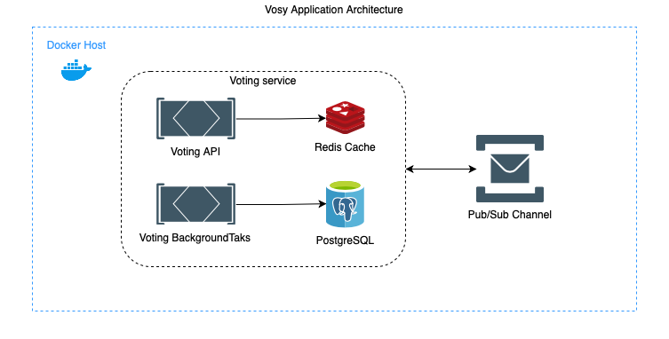

# Vosy - Voting System

The purpose of this project is develop a simple voting system that enables users to perform the following actions:

1. Manage participants. It can be anything that has a name and an image, and the following operations should be available:
    - Store a participant providing at least it's name.
    - Visualize participant's data based on an id.
    - Update a participant, being able to change it's name, image or both at the same time.
    - Delete a participant, but only if it's not in an active voting.

2. Manage votings. A voting must have at least three participants, the date it started, the date it'll finish or have finished, the current status, the total number of votes and number of votes of each participant. The possible operations in a voting must be:
    - Store a voting.
    - Visualize voting's data based on an id.

To make this project possible, the following technologies were used:

- Docker
- .NET Core 3.1
- RabbitMQ
- Radis
- PostgreSQL

## Architecture overview

